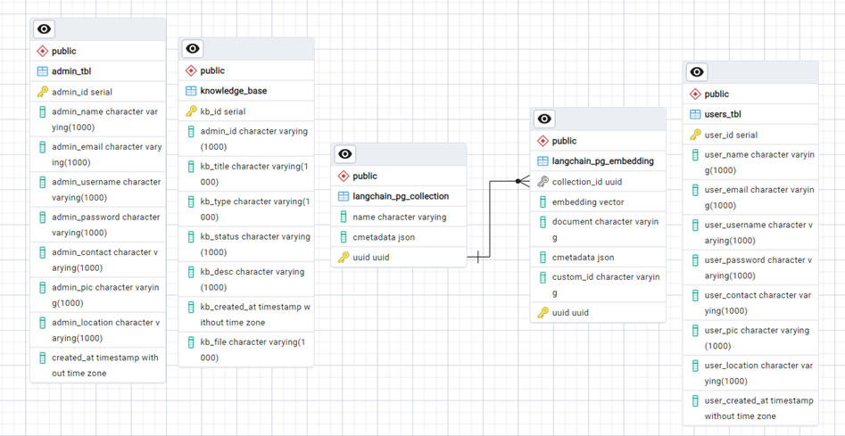

# TBC Student Support Chatbot

## Table of Contents
- [TBC Student Support Chatbot](#tbc-student-support-chatbot)
  - [Table of Contents](#table-of-contents)
  - [Introduction](#introduction)
  - [Objective](#objective)
  - [Chatflix: Your AI Study Buddy](#chatflix-your-ai-study-buddy)
    - [Key Features:](#key-features)
  - [Directory Structure](#directory-structure)
  - [API](#api)
  - [Prerequisites](#prerequisites)
  - [Installation](#installation)
  - [Configuration](#configuration)
  - [Running the Application](#running-the-application)
  - [API Endpoints](#api-endpoints)
    - [AI Query Endpoint](#ai-query-endpoint)
    - [PDF Upload Endpoint](#pdf-upload-endpoint)
  - [Acknowledgements](#acknowledgements)
  - [Chatflix](#chatflix)
  - [Features](#features)
  - [Technologies Used](#technologies-used)
  - [Directory Structure](#directory-structure-1)
  - [Setup Instructions](#setup-instructions)
  - [Usage](#usage)
- [Database](#database)
- [Moodle](#moodle)
  - [Chatbot Integration](#chatbot-integration)
  - [Directory Structure](#directory-structure-2)
  - [File Descriptions](#file-descriptions)
  - [Setup Instructions](#setup-instructions-1)
  - [Features](#features-1)
  - [Dependencies](#dependencies)
  - [Customization](#customization)
  - [Dependencies](#dependencies-1)
- [Installation](#installation-1)
- [Notebooks](#notebooks)
- [Contributing](#contributing)
- [License](#license)


## Introduction
The TBC College Student Support Chatbot is designed to enhance the student experience by providing real-time assistance and information. Leveraging natural language processing and machine learning, the chatbot offers personalized support, answers queries, and assists students through various college processes, thereby improving accessibility and efficiency.

## Objective
The TBC College Student Support Chatbot is an AI-powered virtual assistant designed to provide students with immediate access to information and support. Its primary functions include answering inquiries related to a comprehensive resource guide for international students, covering safety, support services, campus life, and policies, including essential information on scam prevention, human rights, sexual assault, and accessibility.

## Chatflix: Your AI Study Buddy

Chatflix is the friendly and intelligent AI-powered chatbot designed specifically for TBC College students. Named after the popular streaming service but tailored for education, Chatflix is here to make your college experience smoother and more enjoyable.

### Key Features:
1. **24/7 Availability**: Get answers to your questions anytime, anywhere.
2. **Personalized Assistance**: Chatflix learns from interactions to provide tailored support.
3. **Multi-lingual Support**: Communicate in your preferred language.
4. **Course Information**: Access details about classes, schedules, and assignments.
5. **Campus Navigation**: Find your way around TBC College with ease.
6. **Student Services**: Get information on various college services and resources.
7. **FAQ Database**: Quick answers to common questions about college life.

Chatflix aims to enhance your TBC College journey by providing instant, accurate, and helpful information at your fingertips. Whether you're a new student finding your way around campus or a senior looking for career advice, Chatflix is your go-to digital companion for all things TBC College.


## Directory Structure
```
.
├── API
├── Chatflix
├── database
├── notebooks
└── moodle


```

## API

This project is a Flask-based API for handling AI queries and PDF document uploads. It uses LangChain for document processing and retrieval, and PGVector for vector storage in PostgreSQL.

## Prerequisites

- Python 3.x
- PostgreSQL
- Required Python packages (listed in `requirements.txt`)

## Installation

1. **Clone the Repository**:
    ```bash
    git clone https://github.com/deeplcit/tbc_application_1.git
    cd tbc_application_1/API
    ```

2. **Install the required Python packages:**
    ```sh
    pip install -r requirements.txt
    ```

3. **Set up PostgreSQL:**
    - Ensure PostgreSQL is installed and running.
    - Create a database named `chatflix_db`.
    - Update the connection details in `main.py` if necessary.

## Configuration

- **Database Connection:**
    Update the following lines in `main.py` with your PostgreSQL credentials:
    ```python
    connection = psycopg2.connect(user="postgres",
                                  password="1191",
                                  host="127.0.0.1",
                                  port="5432",
                                  database="chatflix_db")

    CONNECTION_STRING = "POSTGRES_CONNECTION_STRING"
    ```

- **Data Directory:**
    Ensure the `DATA_DIR` path is correct:
    ```python
    DATA_DIR = '<your path></your>'
    ```

## Running the Application

1. **Start the Flask app:**
    ```sh
    python API/main.py
    ```

2. **Access the API:**
    The API will be available at `http://0.0.0.0:8080`.

## API Endpoints

### AI Query Endpoint

- **URL:** `/ai`
- **Method:** `POST`
- **Description:** Handles AI queries using the LangChain RetrievalQA chain.
- **Request Body:**
    ```json
    {
        "message": "Your query here"
    }
    ```
- **Response:**
    The AI-generated response.

### PDF Upload Endpoint

- **URL:** `/pdf`
- **Method:** `POST`
- **Description:** Handles PDF uploads and processes them using LangChain.
- **Request Body:**
    - Form-data with a file field named `file`.
- **Response:**
    - `200 OK` with a success message if the upload and processing are successful.
    - `400 Bad Request` if no file is provided or the file is not selected.
    - `500 Internal Server Error` if an error occurs during processing.


## Acknowledgements

- [LangChain](https://github.com/langchain/langchain)
- [PGVector](https://github.com/pgvector/pgvector)
- [Flask](https://flask.palletsprojects.com/)
- [Pydantic](https://pydantic-docs.helpmanual.io/)


## Chatflix

All the code related to Admin panel will be present in Chatflix folder.

The Chatflix Admin Panel is a web-based interface that allows administrators to manage the knowledge base, including adding and deleting PDF files. The panel is built using HTML, CSS, JavaScript, AJAX, and PHP.

## Features

- **Admin Authentication**: Secure login for administrators.
- **Dashboard**: Overview of the admin activities and statistics.
- **Knowledge Base Management**: Add, view, and delete PDF files.
- **User Management**: Manage user information and permissions.
- **Responsive Design**: Optimized for various screen sizes.

## Technologies Used

- **Frontend**: HTML, CSS, JavaScript
- **Backend**: PHP
- **Database**: PostgreSQL
- **AJAX**: For asynchronous data loading and operations

## Directory Structure

```
Chatflix/
├── admin/
│ ├── index.php
│ ├── dashboard.php
│ ├── knowledge_base.php
│ ├── kb_delete.php
│ ├── users.php
│ ├── partials/
│ │ ├── connect.php
│ │ ├── head.php
│ │ ├── css.php
│ │ ├── sidebar.php
│ │ ├── topnav.php
│ │ ├── customizer.php
│ │ ├── js.php
│ └── assets/
│ ├── css/
│ ├── js/
│ └── images/
└── README.md
```

## Setup Instructions

1. **Clone the repository**:
    ```bash
    git clone https://github.com/deeplcit/tbc_application_1.git
    cd tbc_application_1/
    ```

2. **Navigate to the project directory**:
    ```sh
    cd Chatflix
    ```

3. **Database Configuration**:
    - Create a PostgreSQL database.
    - Update the `connect.php` file in the `partials` directory with your database credentials.

4. **Start the server**:
    - Ensure you have a local server environment set up (e.g., XAMPP, WAMP, MAMP).
    - Place the project directory in the server's root directory (e.g., `htdocs` for XAMPP).

5. **Access the Admin Panel**:
    - Open your web browser and navigate to `http://localhost/chatflix/admin`.

## Usage

- **Login**: Use your admin credentials to log in.
- **Dashboard**: View the overview and statistics.
- **Knowledge Base**: Add or delete PDF files.
- **Users**: Manage user information and permissions.

# Database
Below ERD diagram contains the details of the tables and their relationships used as a part of this project



**admin_tbl**:
Description: Stores information about administrators who manage the system.
Usage:
•	Authentication and authorization for admin users.
•	Managing user accounts and permissions.

**knowledge_base**:
Description: Contains details about knowledge resources available to users.
Usage:
•	Storing and managing various types of files added.
•	Providing users with access to relevant information.

**users_tbl**
Description: Contains information about system users.
Usage:
•	User authentication and management.
•	Tracking user activity and preferences.
•	Providing personalized content or recommendations.

**langchain_pg_collection**:
Description: Represents collections of embeddings used for semantic search or similar applications.
Usage:
•	Organizing embeddings based on specific topics or domains.
•	Efficiently retrieving relevant embeddings for query processing.


**langchain_pg_embedding**:
Description: Stores vector representations of documents for semantic search or other machine learning tasks.
Usage:
•	Enabling similarity search based on semantic meaning.
•	Powering recommendation systems or information retrieval.

**Relationship**:
•	admin_tbl and knowledge_base have a one-to-many relationship, with an admin being able to create multiple knowledge bases.
•	langchain_pg_collection and langchain_pg_embedding have a one-to-many relationship, with a collection containing multiple embeddings.
•	users_tbl and knowledge_base have a many-to-many relationship, with users being able to access multiple knowledge bases and knowledge bases being accessible to multiple users.

To know more, refer the `TABLE DETAILS` in documentation

# Moodle
## Chatbot Integration

This project integrates a chatbot into the Moodle platform, providing a user-friendly interface that matches the Moodle UI theme. The chatbot assists users with various queries and enhances the overall user experience.

## Directory Structure
```
moodle/
├── index.php
├── assets/
│ └── images/
│ └── logo.png
├── images/
│ └── bg.jpeg
│ └── logo_v2.png
├── styles/
│ └── styles.css
├── chatbot.js
└── partials/
└── login.php
└── logout.php
└── register.php
```

## File Descriptions

- **index.php**: The main entry point of the application. It includes user authentication, sets the timezone, and loads the main interface with the chatbot.

- **assets/images/**: Contains the favicon/logo used in the application.
  - `logo.png`: The favicon/logo image.

- **images/**: Contains additional images used in the application.
  - `bg.jpeg`: Background image for the main interface.
  - `logo_v2.png`: Logo image used in the chatbot popup.

- **styles/**: Contains the CSS stylesheets.
  - `styles.css`: Main stylesheet for the application.

- **chatbot.js**: JavaScript file that handles the chatbot functionality.

- **partials/**: Contains partial PHP files for user authentication and registration.
  - `login.php`: Handles user login.
  - `logout.php`: Handles user logout.
  - `register.php`: Handles user registration.

## Setup Instructions

1. **Clone the Repository**:
    ```bash
    git clone https://github.com/deeplcit/tbc_application_1.git
    cd tbc_application/moodle
    ```

2. **Database Connection**:
    - Update the `partials/index.php` file with your database connection details.

3. **Start the Server**:
    - Ensure your web server (e.g., Apache, Nginx) is running and configured to serve the `moodle` directory.

4. **Access the Chatbot**:
    - Open your browser and navigate to `http://your-server/moodle/index.php`.

## Features

- **User Authentication**: Ensures that only logged-in users can access the chatbot.
- **Responsive Design**: The chatbot UI is designed to be responsive and match the Moodle theme.
- **Interactive Chatbot**: Provides a floating greeting message and a popup chat interface.

## Dependencies

- **Font Awesome**: For icons used in the chatbot UI.
- **Showdown.js**: For converting markdown to HTML in the chatbot messages.

## Customization

- **Logo and Background**: Replace the images in the `images/` directory to customize the logo and background.
- **Styles**: Modify the `styles/styles.css` file to change the appearance of the chatbot.

3. **Set up the database**:
   - Ensure you have PostgreSQL installed.
   - Create a database and import the necessary tables.

4. **Configure the database connection**:
   - Update the `partials/connect.php` file with your database credentials.

5. **Run the application**:
   - Start a local server (e.g., using XAMPP, WAMP, or a built-in PHP server).
   - Access the application via `http://localhost/moodle`.

## Dependencies

- PHP
- PostgreSQL
- JavaScript
- CSS

# Installation
To know about the installations used in the project refer `DEVELOPER GUIDE` in documentation where the installation steps are given for each software in detail.

# Notebooks
This folder contains the finalized jupyter notebooks as a part of this project for quick reference.
# Contributing

1. Fork the repository.
2. Create a new branch (`git checkout -b feature-branch`).
3. Make your changes and commit them (`git commit -m 'Add new feature'`).
4. Push to the branch (`git push origin feature-branch`).
5. Create a new Pull Request.

# License

This project is licensed under the MIT License. See the [LICENSE](LICENSE) file for details.
